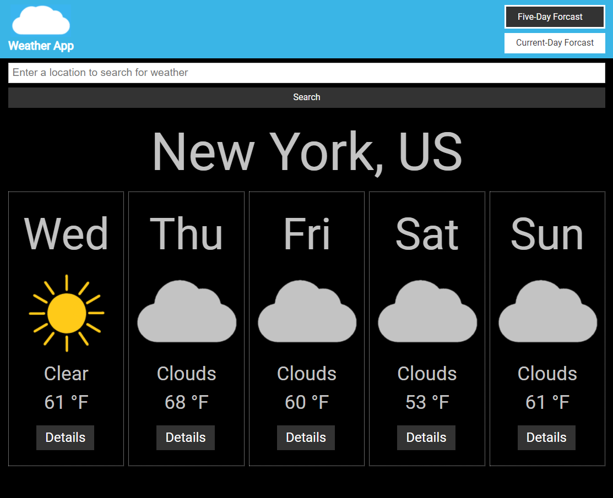

# A Weather App using React and Redux 

A Weather App that enables the user to search for a five-day weather forecast or a current-day weather forecast using a location's zip code, a location's city and state (if within the USA), or a locations city and country. After searching for a weather forecast, the user can click on the "Details" button of a paticular day of the week to see more weather details.

**Version 1.0.0**

# Contributors

* Nicholas Jones https://mynameisnicholasjones.com/

# Motivation

A Weather App designed to demonstrate my understanding of React and Redux.

# Build status

# Screenshot of Weather App

# Tech / framework used

**This weather app was built with:**

* Visual Studio Code
* Node Package Manager (NPM)
* [React](https://reactjs.org/)
* React Router
* Redux
* Fetch API
* [OpenWeatherMap.org's Weather API](https://openweathermap.org/)
* Javascript
* HTML5
* CSS3
* Git
* GitHub

# Features

* Multiple Forecast Types
  * Five-Day Forecast
  * Single-Day Forecast
* More Details Page
* User History for Back Button

# Credits

This software uses the following open source packages:

  * [Node.js](https://nodejs.org/en/)

## License and copyright

© Nicholas Jones
